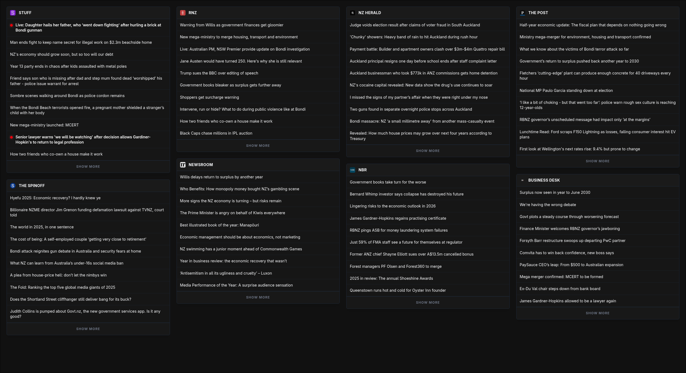

# Frontpage

Aggregates the front page/top stories of select New Zealand media outlets into a single view. Designed to show what each outlet considers the top news at any given time, rather than a reverse-chronological feed.

## Why
Most news aggregators and RSS Feeds focus on recency/a reverse chronological feed.
Frontpage is designed to show you what each publication considers the most important news at a specific moment. It's designed to mimic the experience of visiting the "front page" of all the supported outlets simultaneously.

## Supported Outlets
- [Stuff](https://stuff.co.nz/)
- [RNZ](https://rnz.co.nz/)
- [NZ Herald](https://nzherald.co.nz/)
- [The Post](https://thepost.co.nz/)
- [The Spinoff](https://thespinoff.co.nz/)
- [Newsroom](https://newsroom.co.nz/)
- [NBR](https://www.nbr.co.nz/)
- [BusinessDesk](https://businessdesk.co.nz/)

### Note on Copyright/Scraping
This project simply links to the various articles it finds. There is no attempt to scrape the content of any articles, bypass any paywalls, or take away from ad revenue.

## Running Locally
This project uses [Deno](https://deno.com/) as a runtime.

90% of the project is very lightweight, apart from the NZ Herald scraper, which unfortunately has to use a headless browser. If you are very short on resources, I recommend disabling the herald.
This can be done by removing the `.site` from the file name `websites/sites/herald.site.ts`.

### Steps to run:
1. Ensure [Deno](https://deno.com/) is installed.
2. Clone the project.
3. Use `deno install` in the project directory. If prompted, allow the post-install scripts to run (puppeteer setup).
4. Use `deno task start` to start the project.
5. Visit `http://localhost:9696` (or whichever port is set in main.ts).

## Customization
You can change the order that sites appear by changing the rank integer in each site's file (`websites/sites/*.site.ts`)

To remove a site, remove `.site` from that site's file name.

To add a new site, create a new \<name\>.site.ts file in `websites/sites`, following the same structure as the other sites in the folder.

The port can be changed using the configuration variable at the top of `main.ts`.